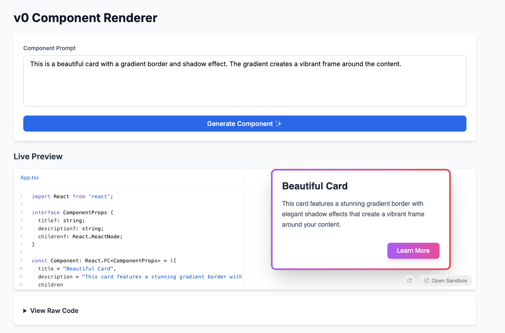

# v0 Component Renderer

A production-safe Next.js app that renders React components generated by Vercel's v0 API using Sandpack for secure iframe isolation.



## Setup

1. Install dependencies:
```bash
npm install
```

2. Copy `.env.local.example` to `.env.local` and add your Vercel API token:
```bash
cp .env.local.example .env.local
```

3. Run the development server:
```bash
npm run dev
```

4. Open http://localhost:3000

## Features

- **v0 API Integration**: Calls v0 API with proper system prompts for consistent component generation
- **Secure Sandboxing**: Uses Sandpack (CodeSandbox) for safe component execution in isolated iframes
- **Tailwind CSS Support**: Components render with full Tailwind styling via CDN
- **Live Preview**: Real-time component preview with code editor
- **Security Headers**: Production-ready CSP and security headers configured

## Architecture

### Security
- Components run in Sandpack's sandboxed iframe with `null` origin
- No access to parent DOM, cookies, or localStorage
- Strict Content Security Policy (CSP) headers
- Input validation with Zod
- Edge runtime for API routes

### Tech Stack
- Next.js 14 (App Router)
- TypeScript
- Sandpack React
- Vercel AI SDK
- Tailwind CSS
- Zod validation

## How it works

1. User enters a component description
2. Edge API route calls v0 with structured system prompt
3. v0 returns TypeScript/React component code
4. Sandpack renders the component in an isolated iframe
5. Tailwind CSS is injected via externalResources

## Example Prompts

- "A button that glows when you hover over it"
- "A card with a gradient border and shadow"
- "A counter with increment and decrement buttons"
- "A todo list where you can add, check off, and delete items"